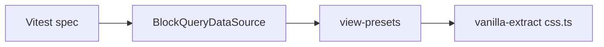

# Post–Phase E follow-ups — implementation plan

> **Scope:** Hardening after Phase E (`affine:data-view` relations / `BlockQueryDataSource`), database package hygiene, and deferred Phase D product decisions.  
> **Tracker:** [table_database_unify_task_tracker.md](./table_database_unify_task_tracker.md)  
> **Design reference:** [data-view-block-relation-spike.md](./data-view-block-relation-spike.md)

---

## Purpose

Stabilize and verify the table/database unification track after Phase E ships: close the **integration-test gap** for `BlockQueryDataSource`, resolve **typecheck / payload-shape** issues around doc-link navigation, and execute **Phase D** only after explicit product decisions.

**Out of scope for this plan:** New relation or rollup features unless they unblock tests or CI.

---

## Success criteria

- **A:** `BlockQueryDataSource` relation and rollup behavior is covered by an **integration-level** test strategy (Vitest-safe import path, or documented E2E substitute) with a clear verification command.
- **B:** `tsc --noEmit -p blocksuite/affine/blocks/database` (or equivalent Nx target) passes; `affine-doc-link-clicked` and `DocLinkClickedEvent` are aligned without breaking navigable payloads for subscribers.
- **C:** Phase D rows in the unification tracker have **owner, decision, and target** (or are explicitly deferred).

---

## Context (repo facts)

### Integration test gap

- [`blocksuite/affine/blocks/data-view/src/data-source.ts`](../../blocksuite/affine/blocks/data-view/src/data-source.ts) imports `viewConverts` from `@blocksuite/data-view/view-presets`. View-presets pulls in UI modules and **vanilla-extract** `*.css.ts` files, which **breaks Vitest** when specs import `BlockQueryDataSource` directly.
- Current coverage is **narrow**: [`relation-container-data-view.unit.spec.ts`](../../blocksuite/affine/blocks/database/src/__tests__/relation-container-data-view.unit.spec.ts) only tests [`relation-container-cells.ts`](../../blocksuite/affine/blocks/database/src/utils/relation-container-cells.ts) with mocked `affine:data-view` shapes—not the full `BlockQueryDataSource` lifecycle.

### Typecheck / `DocLinkClickedEvent`

- [`DocLinkClickedEvent`](../../blocksuite/affine/inlines/reference/src/reference-node/types.ts) is `ReferenceInfo & { openMode?; event?; host }`.
- [`ReferenceInfo`](../../blocksuite/affine/model/src/consts/doc.ts) uses `pageId` and optional `params` (e.g. `params.blockIds`), not a top-level `blockId`.
- [`database-block.ts`](../../blocksuite/affine/blocks/database/src/database-block.ts) handles `affine-doc-link-clicked` with `CustomEvent<{ pageId: string; blockId: string }>` and calls `docLinkClicked.next({ pageId, blockId, host })`—that shape diverges from `DocLinkClickedEvent`.
- Relation UI dispatches the same pattern: [`relation/cell-renderer.ts`](../../blocksuite/affine/data-view/src/property-presets/relation/cell-renderer.ts) uses `detail: { pageId, blockId }`.

**When executing:** Confirm failures with `npx tsc --noEmit -p blocksuite/affine/blocks/database` (or workspace convention). Then either **map** `blockId` → `params: { blockIds: [blockId] }` at `next(...)` call sites, **widen** types only if product requires both shapes (less ideal), or **standardize** the `CustomEvent` detail type. Affected call sites to audit include:

- `database-block.ts`
- `linked-database-block.ts`
- `data-view` relation `cell-renderer.ts`
- Any subscribers that assume a single block id (e.g. [`playground` starter](../../blocksuite/playground/apps/starter/utils/extensions.ts))

### Phase D (product / policy)

From the tracker § Phase D:

| ID  | Task                                                                       |
| --- | -------------------------------------------------------------------------- |
| D.1 | Optional: remove **Simple table** slash after analytics — **product call** |
| D.2 | Auto-prompt migration on doc open — **optional enhancement**               |

These need **owner**, **metrics gate** (D.1), and **UX spec** (D.2), not only engineering tickets.

---

## Workstream A — `BlockQueryDataSource` integration tests

| Step    | Action                                                                                                                                                                                                                                                                                              |
| ------- | --------------------------------------------------------------------------------------------------------------------------------------------------------------------------------------------------------------------------------------------------------------------------------------------------- |
| **A.1** | Document the import graph: test → `BlockQueryDataSource` → `view-presets` → vanilla-extract `*.css.ts`.                                                                                                                                                                                             |
| **A.2** | Spike and choose one path (prefer lowest coupling first):                                                                                                                                                                                                                                           |
|         | **Decouple** — Move or narrow `viewConverts` (or a minimal subset) so non-UI code in `data-source.ts` does not import the full view-presets graph.                                                                                                                                                  |
|         | **Test harness** — Vitest config (e.g. deps optimizer / SSR / mocks for `.css.ts`); align with existing Blocksuite patterns.                                                                                                                                                                        |
|         | **Layer test** — Playwright or existing E2E for query view + relation (slower, broader).                                                                                                                                                                                                            |
|         | **Contract test** — Extract pure logic (relation cell read/write, rollup epoch invalidation) into a Vitest-safe module; keep thin wiring in `data-source.ts`.                                                                                                                                       |
| **A.3** | Define minimum scenarios: add relation column → link row → reverse column on target DB → change linked cell → rollup recomputes; optionally **orphaned cell keys** per ADR in [data-view-block-relation-spike.md](./data-view-block-relation-spike.md).                                             |
| **A.4** | **Verify:** `pnpm test --run` / `yarn vitest run` with filter for the new spec(s). **Implemented:** `@blocksuite/affine-block-data-view` runs `yarn vitest run` in `blocksuite/affine/blocks/data-view` (config includes `@vanilla-extract/vite-plugin`). Optional rollup-only scenario still open. |

---

## Workstream B — Database package typecheck

| Step    | Action                                                                                                                                                                                                                                                                                        |
| ------- | --------------------------------------------------------------------------------------------------------------------------------------------------------------------------------------------------------------------------------------------------------------------------------------------- |
| **B.1** | Run `tsc --noEmit -p blocksuite/affine/blocks/database` (or Nx equivalent). Record failures in tracker appendix or issue when executing.                                                                                                                                                      |
| **B.2** | Normalize `affine-doc-link-clicked` detail vs `DocLinkClickedEvent` (see context above).                                                                                                                                                                                                      |
| **B.3** | **Regression:** Subscribers of `RefNodeSlotsProvider.docLinkClicked` still receive a navigable payload; validate playground and app-level handlers. **Done:** `docLinkClicked.next` now passes `params: { blockIds: [...] }` per `ReferenceInfo` (`database-block`, `linked-database-block`). |

---

## Workstream C — Phase D decisions

| Step    | Action                                                                                                                                                                        |
| ------- | ----------------------------------------------------------------------------------------------------------------------------------------------------------------------------- |
| **C.1** | Schedule product decision on **D.1**: analytics threshold, communication for Simple table sunset.                                                                             |
| **C.2** | If **D.2** proceeds: UX (when to prompt, dismiss, “don’t show again”), technical hook on doc open, link to migration path from Phase B (`migrateTableBlockToDatabase`, etc.). |
| **C.3** | Update tracker rows D.1/D.2 with status, owner, target release **after** decisions. **Tracker:** Phase D rows note product-owner / defer and link here until decided.         |

---

## Ordering and dependencies

- **B** is small and reduces merge risk if CI is strict; can run in parallel with **A** spike.
- **C** is parallel to engineering but **blocks** implementation of D.1/D.2 until product signs off.

---

## Risks

| Risk                                                 | Mitigation                                                                            |
| ---------------------------------------------------- | ------------------------------------------------------------------------------------- |
| Decoupling view-presets touches many exports         | Time-box spike; prefer contract tests if decouple is large.                           |
| Vitest remains blocked for full `data-source` import | Fall back to E2E + narrow unit tests; document in tracker.                            |
| Changing `docLinkClicked` payload breaks integrators | Coordinate with consumers; prefer mapping at emit site over changing `ReferenceInfo`. |

---

## Related files (quick index)

| Area                               | Path                                                                                        |
| ---------------------------------- | ------------------------------------------------------------------------------------------- |
| `BlockQueryDataSource`             | `blocksuite/affine/blocks/data-view/src/data-source.ts`                                     |
| View converts entry                | `@blocksuite/data-view/view-presets`                                                        |
| Relation container helpers         | `blocksuite/affine/blocks/database/src/utils/relation-container-cells.ts`                   |
| Data-view relation tests (current) | `blocksuite/affine/blocks/database/src/__tests__/relation-container-data-view.unit.spec.ts` |
| Doc link handler                   | `blocksuite/affine/blocks/database/src/database-block.ts`                                   |
